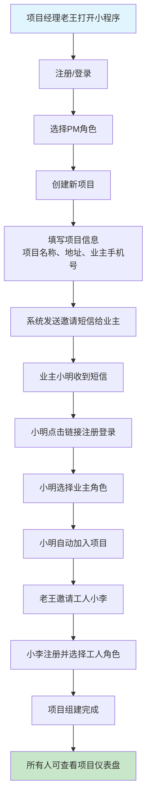
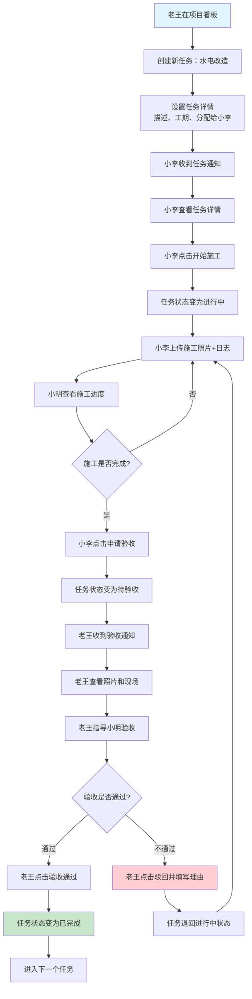

# "自己装"平台 MVP 范围定义

## MVP 功能范围

### 核心功能（P0 - 必须有）
1. **用户注册与角色管理** - 支持项目经理、业主、工人三种角色注册和权限管理
2. **项目创建与邀请** - 项目经理创建项目，邀请业主和工人加入
3. **项目协同看板** - 可视化任务管理，支持任务创建、分配、状态跟踪
4. **任务验收流程** - 工人申请验收→项目经理审核→通过/驳回的完整闭环

### 重要功能（P1 - 应该有）
5. **施工打卡+照片记录** - 工人施工过程中上传带时间戳的现场照片
6. **项目群聊** - 项目内所有参与方的集中沟通渠道

### 辅助功能（P2 - 可以有）
7. **支出记录工具** - 简单的项目财务记录功能

---

## 核心用户旅程

### 旅程1：项目经理主导的项目启动旅程
```
项目经理老王 → 注册登录选择PM角色 → 创建"小明家装修项目" → 
填写项目基本信息（地址、业主联系方式）→ 系统自动发送邀请短信给业主小明 → 
小明收到短信注册加入项目 → 老王邀请水电工小李加入项目 → 
项目组建完成，所有人可看到项目仪表盘
```

### 旅程2：日常协同工作旅程
```
老王在看板创建"水电改造"任务 → 分配给工人小李，设置预计工期3天 → 
小李收到任务通知，点击"开始施工" → 施工过程中上传进度照片和简短日志 → 
业主小明随时查看照片了解进度 → 小李完工后点击"申请验收" → 
老王收到验收通知，查看照片和现场情况 → 指导小明进行验收检查 → 
老王操作"验收通过"，任务状态变为"已完成" → 进入下一个任务环节
```

### 旅程3：问题沟通解决旅程
```
小明在项目群聊中提问："这个电线走向是否合理？" → 
老王快速回复并@小李解释工艺标准 → 小李上传详细施工图片说明 → 
老王提供专业建议和后续注意事项 → 问题得到解决，沟通记录保存在群聊中
```

---

## 用户流程图

### 旅程1：项目启动流程图



### 旅程2：日常协同工作流程图



### 旅程3：问题沟通解决流程图

```mermaid
flowchart TD
    A[小明在项目群聊] --> B[发送问题：电线走向是否合理?]
    B --> C[老王收到消息通知]
    C --> D[老王查看问题]
    D --> E[老王@小李并回复解释]
    E --> F[小李收到@通知]
    F --> G[小李上传详细施工图片]
    G --> H[小李文字说明工艺标准]
    H --> I[老王补充专业建议]
    I --> J[小明查看回复和图片]
    J --> K{问题是否解决?}
    K -->|是| L[小明表示理解和感谢]
    K -->|否| M[小明继续提问]
    L --> N[问题解决，记录保存]
    M --> D
    
    style A fill:#e1f5fe
    style N fill:#c8e6c9
```

---

## 关键设计原则

1. **简化用户操作** - 每个角色的核心操作不超过3步完成
2. **强化协同感知** - 任何状态变更都要及时通知相关方
3. **可视化进度** - 业主能像查看外卖进度一样查看装修进度
4. **建立信任机制** - 通过照片记录和验收流程建立透明度

## MVP成功指标

- **用户留存：** 7日留存率>40%，30日留存率>20%
- **使用深度：** 平均每个项目使用时长>30天
- **协同效率：** 任务完成率>80%，验收通过率>85%
- **用户满意度：** NPS得分>50
